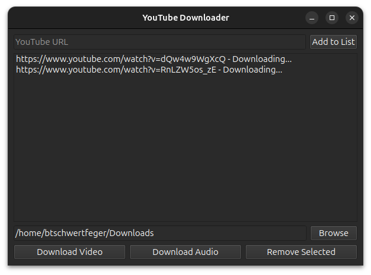

# ytdownloader

> ⚠️ **Note**: This application is not affiliated with YouTube or yt-dlp. It is
> simply a GUI wrapper around the yt-dlp library to make it easier to use.
> Please respect the YouTube terms of service when using this application.
> Downloading videos may violate the terms of service.

The ytdownloader is a lightweight cross-platform desktop application that allows
you to download video and audio from YouTube. It is written in Python and uses
the [yt_dlp](https://github.com/yt-dlp/yt-dlp) library to download videos.

<p align="center">
    
</p>

## 🛠️ Prerequisites

ffmpeg must be installed in order to download music. You can install it using
the following commands:

**Ubuntu**: `sudo apt install ffmpeg`

**macOS**: `brew install ffmpeg`

**Windows**: [Download
ffmpeg](https://www.gyan.dev/ffmpeg/builds/ffmpeg-release-full.7z), unzip, and
put its `bin` directory in the system PATH.

## 🚀 Installation

The executables can be downloaded from the latest releases on the GitHub
(https://github.com/btschwertfeger/ytdownloader/releases) or
via local installation:

```bash
git clone https://btschwertfeger/ytdownloader
cd ytdownloader
uv pip install .
ytdownloader
```

## 📌 Notes

- The applications is not signed, so you may need to allow it to run in your
  system settings.
- Since this is mostly a personal project, I will not be adding any new features
  unless I need them.
- If you have any suggestions or issues, feel free to open an issue or a pull
  request.
